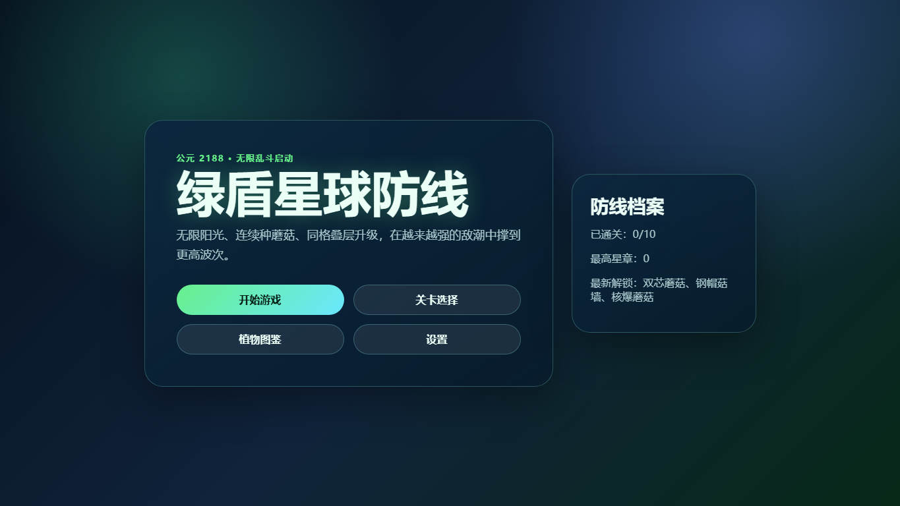
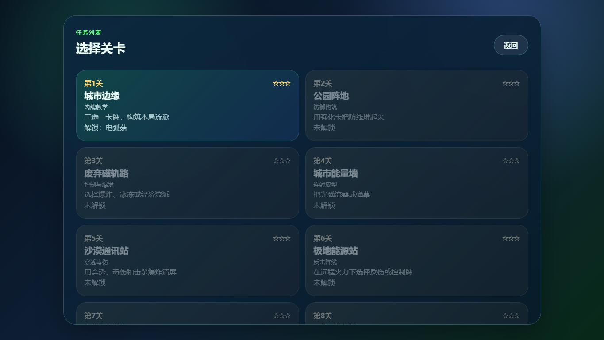
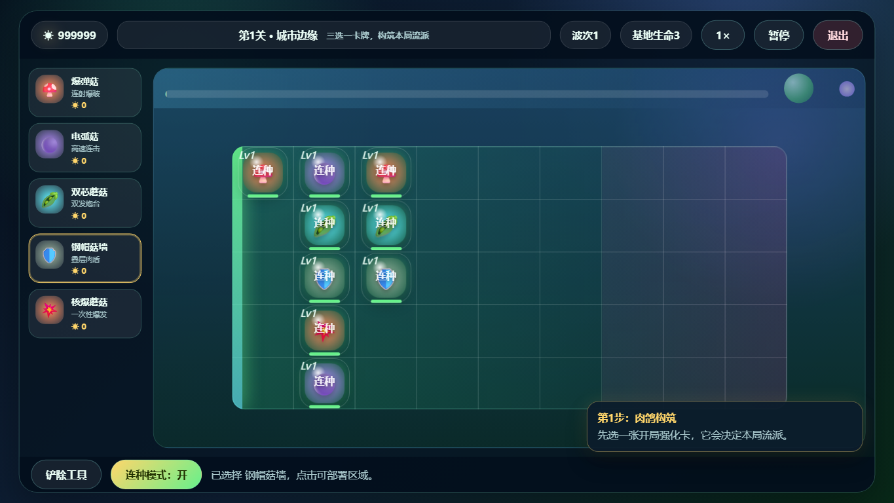
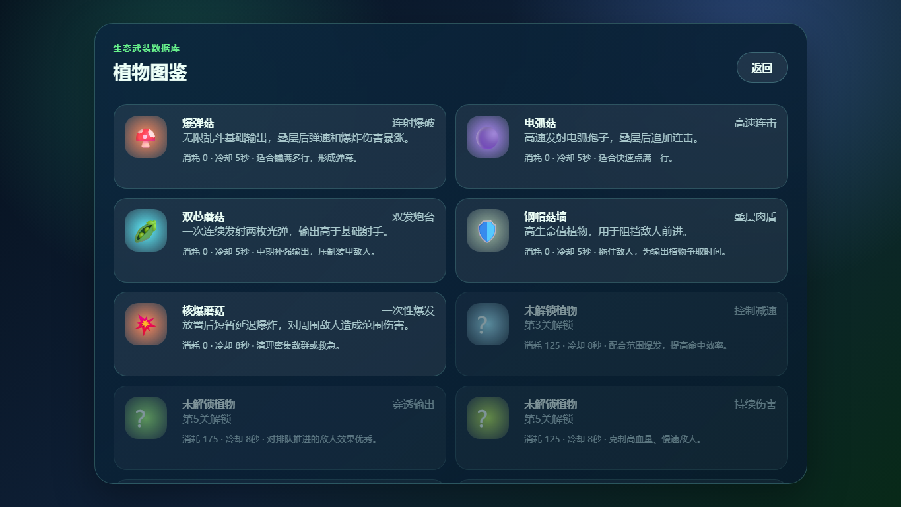
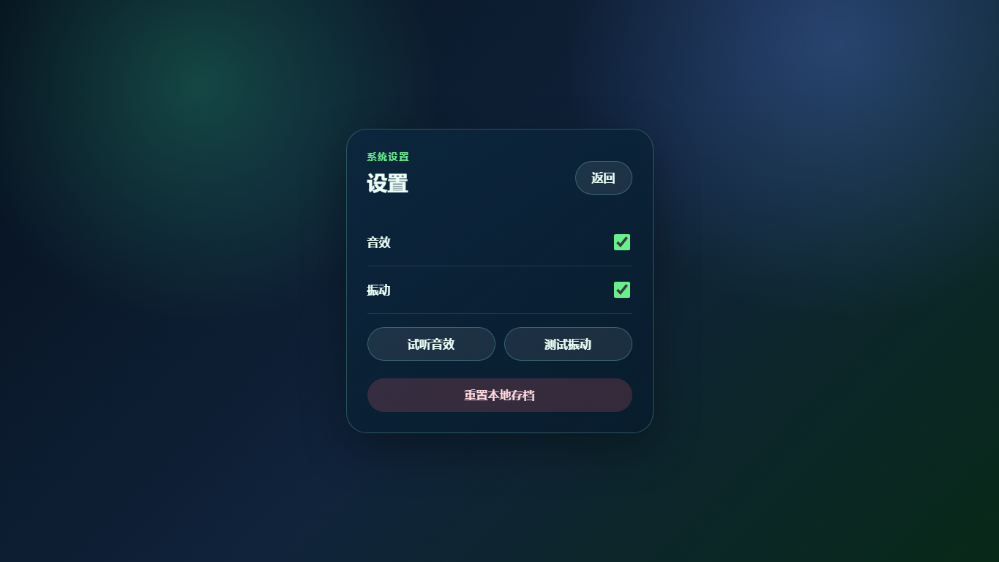

# 绿盾星球防线

## 1. 游戏标题、团队名称和成员

- **游戏标题**：绿盾星球防线
- **团队名称**：待补充
- **团队成员**：待补充
- **游戏类型**：横版格子塔防 / 轻策略 / H5 休闲小游戏
- **运行平台**：H5 网页，兼容 PC 浏览器与移动端横屏

## 2. 核心玩法介绍（200字内）

《绿盾星球防线》是一款科幻生态主题的横版格子塔防游戏。玩家在 5×9 战场中连续部署防卫植物，利用输出、防御、爆发、控制和辅助单位抵挡从右侧入侵的外星敌潮。战斗中可通过同格叠层升级植物，并在肉鸽三选一强化中构筑本局流派，坚持更高波次、守住基地生命。

## 3. 操作指南

### 按键说明

| 操作 | 说明 |
| --- | --- |
| 鼠标左键 / 触屏点击 | 点击按钮、选择植物卡牌、部署植物、选择强化卡 |
| 点击植物卡牌 | 选中要部署的植物 |
| 点击战斗网格空格 | 在目标格子部署当前植物 |
| 点击已有植物 | 对该植物进行叠层升级 |
| 点击“铲除工具” | 进入/退出铲除模式，再点击植物可移除 |
| 点击“连种模式” | 开启/关闭自动收集与连续部署辅助 |
| 点击“1× / 2×” | 切换普通速度与快速模式 |
| 点击“暂停 / 继续” | 暂停或恢复当前战斗 |
| 点击“退出” | 退出当前战斗并返回主界面 |

### 基本规则

1. 敌人从战场右侧向左推进，突破最左侧基地线会扣除基地生命。
2. 基地生命初始为 3，生命归零则本局失败。
3. 每个格子最多放置 1 个植物；点击同格已有植物会升级，而不是重新放置。
4. 植物包含输出、防御、爆炸、减速、穿透、毒伤、眩晕、反弹、破甲、治疗、激光、全屏脉冲等不同定位。
5. 战斗会持续刷新敌潮，波次越高敌人越强，并会出现装甲、飞行、远程、自爆、护盾和 Boss 等机制敌人。
6. 肉鸽强化卡会改变本局流派，例如提升射击伤害、强化爆炸、增加穿透、增强减速或触发全屏脉冲。
7. 合理组合植物与强化卡，尽量拖住敌人、叠高输出、守住基地并挑战更高波次。

## 4. 游戏截图











## 5. 试玩视频链接

- **试玩视频链接**：待补充
- **视频时长要求**：不少于 3 分钟
- **建议录制内容**：主界面 → 关卡选择 → 战斗部署 → 植物升级 → 强化卡选择 → 敌潮推进 / 结算界面

> 上传到网盘或在线视频平台后，将上方“待补充”替换为实际链接即可。

## 运行方式

直接用浏览器打开 `index.html` 即可运行，无需安装依赖或构建。

也可以在当前目录启动任意静态服务器，例如：

```bash
python -m http.server 8000
```

然后访问 `http://localhost:8000/`。

## 已实现内容

- 主界面、关卡选择、植物图鉴、设置、胜利/失败结算。
- 战斗界面包含植物卡牌栏、太阳能量、波次进度、暂停、快速模式、自动收集、铲除、基地生命和目标提示。
- 5 行 × 9 列塔防网格，敌人从右向左推进，突破左侧基地线扣除生命。
- 15 种植物配置与 MVP 机制：直线射击、双发、防御、爆炸、减速、穿透、毒伤、眩晕、反弹、破甲、范围投掷、治疗、激光、盖亚脉冲。
- 10 种敌人配置与表现：基础、快速、装甲、远程、飞行、护盾、自爆、冲锋、精英、最终 Boss。
- 10 个主线关卡与逐步解锁流程，最终关包含母舰投影体的召唤、护盾、轨道轰炸和磁场干扰。
- 本地存档保存已通关关卡、最高星级、音效开关、振动开关和新手引导完成状态。
- 第 1 关包含分步新手引导，设置页提供音效试听和振动测试。
- 无外部素材，使用 CSS 图形、emoji、Web Audio 和 DOM 动效完成原型表现。
